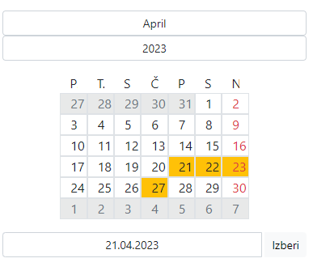

# Koledar

## Opis
- nedelje v koledarju so označene z rdečo barvo
- prazniki so označeni z rumenom barvom ozadja
- mesec lahko spreminjamo z padajočim menijem nad koledarom
- leto lahko izberemo vnosom leta v polje nad koledarom (Opomba: leto ne sme biti večje kot 9999)
- lahko vnesemo poljuben datum (format: dd.MM.yyyy) v polje pod koledarom in klikom na gumb "Izberi" nam se koledar posodobi

## Videz koledara
- Slika prikazuje videz koledarja za dan 21.04.2023
- Na sliki lahko vidimo praznik Dan upora proti okupatorju 27.04 in
- Muslimanski verski praznik Bajram 21-23.04


- Koledar je tudi lepo odziven na manjših zaslonih:


## Lokalna namestitev
- za lokalno namestitev na svojem računlaniku potrebno je imeti: Node.js, npm in Angular CLI
- poženemo ukaza:
1. ```npm install```
2. ```npm start```
- aplikacija je potem dostopna na http://localhost:4200/

## Dostop
Koledar je na voljo na naslovu: https://vinicultural-clang.000webhostapp.com/
