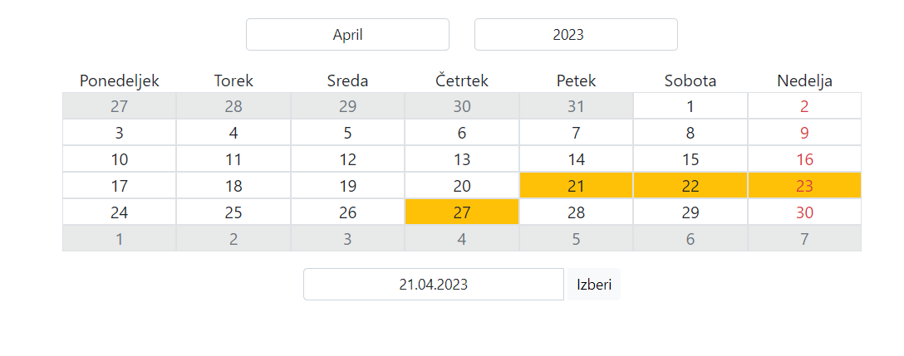

# Koledar

## Opis
- nedelje v koledarju so označene z rdečo barvo
- prazniki so označeni z rumenim robom
- mesec lahko spreminjamo z padajočim menijem nad koledarom
- leto lahko izberemo vnosom leta v polje nad koledarom (Opomba: leto ne sme biti večje kot 9999)
- lahko vnesemo poljuben datum (format: dd.MM.yyyy) v polje pod koledarom in klikom na gumb "Izberi" nam se koledar posodobi

## Videz koledara
Slika prikazuje videz koledarja za dan 20.04.2023:



Koledar je tudi lepo odziven na manjših zaslonih:


## Lokalna namestitev
- za lokalno namestitev potrebno je imeti Node in Angular nameščen
- poženemo ukaza:
1. ```npm install```
2. ```npm start```
- aplikacija je potem dostopna na http://localhost:4200/

## Dostop
Koledar je na voljo na naslovu: https://vinicultural-clang.000webhostapp.com/
